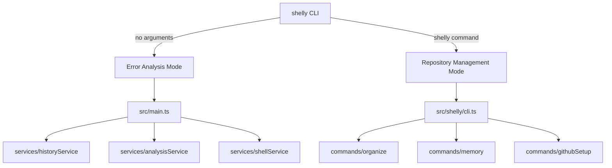
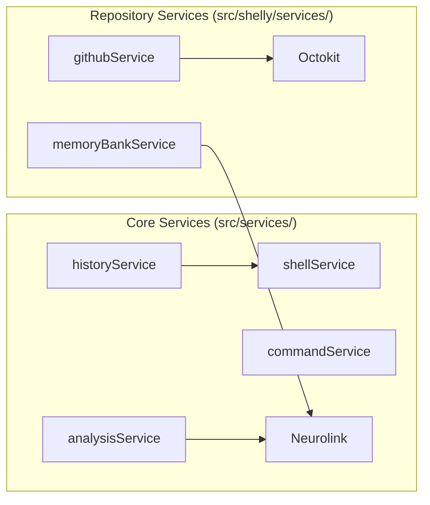

# Architecture

## Dual CLI Architecture

Shelly has two distinct entry points:

### Error Analysis Mode (`src/main.ts`)

- **Entry point**: `dist/main.js`
- **Usage**: `shelly` (no arguments) or `shelly "command"`
- **Purpose**: Analyzes failed shell commands via AI

Key services:

| Service  | File                          | Purpose                         |
| -------- | ----------------------------- | ------------------------------- |
| History  | `services/historyService.ts`  | Shell history retrieval         |
| Command  | `services/commandService.ts`  | Command execution               |
| Analysis | `services/analysisService.ts` | AI error analysis via Neurolink |
| Shell    | `services/shellService.ts`    | Multi-shell support             |
| Rules    | `rules/`                      | Pattern-based corrections       |

### Repository Management Mode (`src/shelly/cli.ts`)

- **Entry point**: `dist/shelly/cli.js`
- **Usage**: `shelly <command>` (organize, memory, github, etc.)
- **Purpose**: Project scaffolding, GitHub setup, Memory Bank

Key components:

| Component | File                             | Purpose                       |
| --------- | -------------------------------- | ----------------------------- |
| Organize  | `shelly/commands/organize.ts`    | Repository scaffolding        |
| Memory    | `shelly/commands/memory.ts`      | Memory Bank management        |
| GitHub    | `shelly/commands/githubSetup.ts` | GitHub configuration          |
| Templates | `shelly/templates/`              | Project scaffolding templates |

## Service Layer

## Key Integration: Neurolink

All AI operations use `@juspay/neurolink` (Google Vertex AI wrapper):

- Error analysis and suggestions
- Memory Bank content generation
- AI-assisted scaffolding

## Module System

- **ESM** (`"type": "module"` in package.json)
- **TypeScript** targeting ES2022
- Import paths use `.js` extensions (ESM requirement)
- Output to `dist/` directory matching `src/` structure

## Template System

Templates in `src/shelly/templates/` are:

1. Copied to `dist/` during build via `scripts/copy-templates.js`
2. Included in the published npm package
3. Support variable substitution for project-specific values
